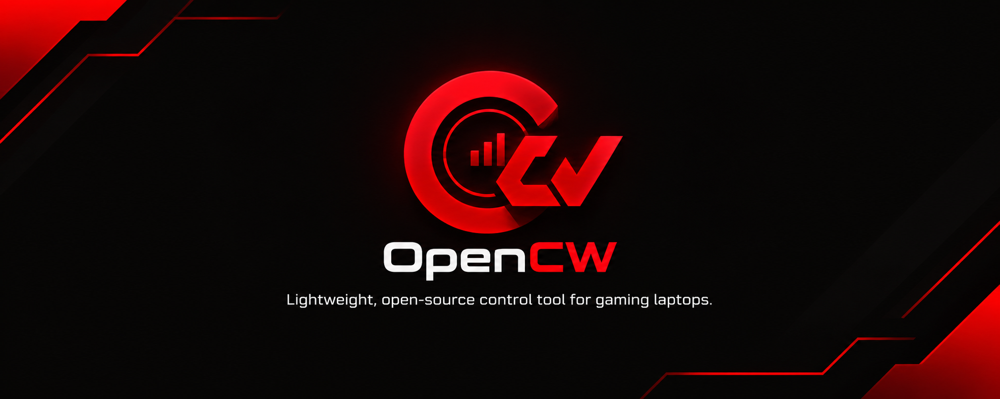

<p align="center">
  
</p>

# OpenCW (Open Controlware) — Open-Source Gaming Laptop Control Center

<p align="center">
  <a href="https://github.com/berkevnl/OpenCW/releases"></a>
  <a href="https://github.com/berkevnl/OpenCW/releases/latest/download/OpenCW.exe"></a>
  <a href="https://github.com/berkevnl/OpenCW/blob/main/LICENSE"></a>
  <a href="#-why-opencw-advantages"></a>
  <a href="README.tr.md"></a>
</p>

---

**OpenCW (Open Controlware)** is an ultra-lightweight, modular open-source hardware control center for gaming laptops. It is engineered to replace heavy, unstable, and bloated OEM vendor software suites (Control Centers) with a single, respectful, zero-bloat portable executable.

Modeled after the beloved **G-Helper** philosophy, OpenCW features an extensible multi-brand architecture: upon launching a single `.exe`, it automatically inspects your machine's hardware identity, binds the corresponding vendor-specific ACPI/EC engine, and presents a unified, lightning-fast flyout control panel.

<p align="center">
  <a href="https://github.com/berkevnl/OpenCW/releases/latest/download/OpenCW.exe">
    
  </a>
  <br>
  <sub><i>If the direct download button does not start automatically, please visit <a href="https://github.com/berkevnl/OpenCW/releases/latest">Releases</a> to download the latest executable.</i></sub>
</p>

---

## ⚡ Why OpenCW? (Advantages)

1. **Multi-Brand Architecture, Single Executable:** One standalone `.exe` serves all supported laptop brands. No multi-gigabyte downloads or device-specific installers.
2. **Ultra-Low Memory Footprint:** Consumes only **~5 - 10 MB RAM** idling in the system tray and **~20 - 35 MB RAM** when the management flyout is actively displayed.
3. **Zero Background Bloatware:** No background daemons, no telemetry trackers, no analytics agents, and no unnecessary services eating CPU cycles.
4. **Permanent Settings Persistence:** User configurations (RGB keyboard lighting, power profile, brightness) automatically survive system restarts and shutdowns via elevated Windows Task Scheduler startup and delayed EC post-boot synchronization.
5. **Direct Hardware Communication:** Talks directly to the motherboard Embedded Controller (EC / ACPI SMI / WMI), completely bypassing bloated third-party vendor services.
6. **Instant Flyout UI:** Lives discreetly in your System Tray (Taskbar Notification Area). Clicking the tray icon snaps open an elegant, high-DPI flyout panel that can also be freely dragged anywhere on screen.
7. **Bilingual & Dual Theme:** Instant toggles between Turkish and English, plus authentic Matte Dark and Clean Light themes.

---

## 🏗️ Multi-Vendor Architecture

OpenCW uses a decoupled, modular design patterned after clean software engineering principles:

```
                  ┌─────────────────────────────────────────┐
                  │          OpenCW Unified UI              │
                  │   (Flyout / Tray / Single View Model)   │
                  └────────────────────┬────────────────────┘
                                       │
                      ┌────────────────┴────────────────┐
                      │    HardwareDetector & Factory   │
                      │  (WMI / SMBIOS Vendor Discovery)│
                      └────────────────┬────────────────┘
                                       │
            ┌──────────────────────────┼──────────────────────────┐
            ▼                          ▼                          ▼
 ┌──────────────────────┐   ┌──────────────────────┐   ┌──────────────────────┐
 │   Casper Excalibur   │   │  Upcoming Brands...  │   │  Simulation Provider │
 │  (ACPI WMI SMI EC)   │   │    (Lenovo / HP)     │   │ (Development/Testing)│
 └──────────────────────┘   └──────────────────────┘   └──────────────────────┘
```

* **Dynamic Lazy Instantiation:** Only the detected vendor's bridge class is instantiated in memory. Code for other brands remains inert, preserving near-zero RAM usage and lightning-fast boot times.
* **Unified UI Surface:** Regardless of whether your laptop is an Excalibur or any future supported model, the interface remains identical, predictable, and polished.

---

## 🎯 Features

### 1. Performance Profiles
* **Silent (Office):** Low fan RPM, quiet operation, and energy efficiency.
* **Balanced (Gaming):** Dynamic fan curves and balanced thermals for everyday gaming.
* **Turbo (High Performance):** Maximum fan airflow, maximum thermal headroom, and peak sustained clock speeds.
* *Integrated with Windows native power plans (`PowerSetActiveScheme`).*

### 2. Real-Time Telemetry
* **CPU & GPU Metrics:** Real-time temperature readouts (°C) and tachometer fan speeds (RPM).
* **System Resources:** Live RAM allocation (used / total GB and percentage) and primary SSD (C:) storage utilization.
* **System Tray Tooltip:** Hovering over the tray icon reveals current temperatures and fan RPMs without opening the window.

### 3. RGB Keyboard Backlight Control
* **Modes:** Static, Breathing, Colorful Dynamic Cycle, and Off.
* **Interactive Color Spectrum:** Smooth 360° hue selector with curated quick-access preset palettes.
* **Hardware Brightness Steps:**
  * `0` : **Off (0%)** — Shuts down all keyboard LED zones.
  * `1` : **50% Brightness** — Balanced ambient illumination.
  * `2` : **100% Brightness** — Full maximum brightness.
* **Reboot Resilience:** Preserves your lighting mode, brightness, and colors even after cold boots.

### 4. Usability & System Integration
* **Start with Windows:** Elevated logon task scheduling that silently starts OpenCW minimized to tray without triggering UAC warnings.
* **One-Click Theme Switch:** Toggle between Authentic Matte Dark and Clean High-Contrast Light mode.
* **Integrated Auto-Updater:** Checks GitHub Releases for new updates with a single click.

---

## 💻 Hardware Compatibility

OpenCW dynamically identifies your laptop model at startup:

### ✅ Casper Excalibur Family (Native ACPI SMI Engine)
> Verified on physical hardware: **Excalibur G770**, **G850**, and **G911** have been tested and work flawlessly (power profiles, telemetry, and keyboard RGB lighting).

* **Excalibur G770** (Tested & Verified)
* **Excalibur G850 / G860** (Tested & Verified)
* **Excalibur G911** (Tested & Verified)
* **Excalibur G780**
* **Excalibur G870**
* **Excalibur G900**
* **Excalibur G920**

### ⏳ Upcoming Hardware Bridges (Planned)
* **Lenovo Legion Series**
* **HP Omen & Victus Series**

*(Contributions are welcome! If you want to contribute reverse-engineered ACPI/WMI/SMI bridges for other laptop vendors, please check the [Hardware Architecture](src/OpenCW/Hardware/) directory.)*

### 🧪 Simulation Mode
* On non-gaming PCs, unsupported laptops, or virtual machines, OpenCW automatically engages the simulation hardware provider for smooth interface previews and development testing.

---

## 🚀 Download & Quick Start

1. Go to the [Releases](https://github.com/berkevnl/OpenCW/releases/latest) page.
2. Download `OpenCW.exe` (standalone portable binary, no installation required).
3. Right-click `OpenCW.exe` and select **Run as Administrator** *(Administrator privileges are required by Windows to communicate with ACPI WMI SMI hardware ports)*.
4. OpenCW docks into your **System Tray** (near the clock). Click the red OpenCW icon to open your control flyout!

---

## 💖 Acknowledgments & Inspiration

This project draws foundational inspiration from **[Seerge](https://github.com/seerge)** and the **[G-Helper](https://github.com/seerge/g-helper)** project.

G-Helper revolutionized laptop utility design by proving that proprietary, bloated OEM software suites can be replaced with transparent, blazing-fast, and respectful open-source tools. **OpenCW** brings that same philosophy to a multi-vendor gaming laptop ecosystem.

---

## ⚖️ Trademarks & Legal Disclaimer

* All product names, logos, and brands mentioned in this project are property of their respective owners and are used solely for identification and hardware compatibility purposes.
* **OpenCW** is an independent, community-driven open-source project.
* This software is distributed under the **GNU General Public License v3.0 (GPL-3.0)** "as is", without warranty of any kind.
