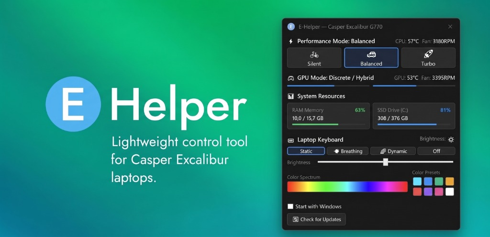

  

# E-Helper — Casper Excalibur Dizüstü Bilgisayarlar İçin Hafif Kontrol Aracı

  
  
  
  
  

---

Casper Excalibur oyuncu dizüstü bilgisayarları için resmi **Excalibur Control Center** yazılımının yüksek kaynak tüketen ve kararsız yapısına alternatif olarak geliştirilmiş açık kaynaklı, ultra hafif ve taşınabilir kontrol aracıdır.

**Excalibur G770, G780, G850, G870, G900, G911, G920** ve Quanta ODM tabanlı tüm Casper Excalibur modelleriyle uyumludur.

  
   
  <i>Doğrudan indirme butonu başlamazsa lütfen <a href="https://github.com/berkevnl/e-helper/releases/latest">Releases (Sürümler)</a> sayfasından son sürümü edinin.</i>

---

## ⚡ Neden E-Helper? (Temel Avantajlar)

1. **Ultra Düşük Bellek Tüketimi:** Arka planda sistem tepsisinde çalışırken yalnızca **~5 - 10 MB RAM** harcar. Yönetim paneli ekranda açıkken dahi tüketim **~20 - 35 MB** seviyesindedir.
2. **Kurulumsuz & Sıfır Şişkinlik (Bloat-Free):** Kurulum gerektirmeyen tek bir `.exe` dosyasından ibarettir. Sisteme ek sürücü, servis, telemetri takipçisi veya başlangıç görevleri yüklemez.
3. **Doğrudan Yerel Donanım Köprüsü:** Üçüncü taraf hantal servisler yerine Windows'un yerel WMI ACPI SMI (`RW_GMWMI`) kanalı üzerinden anakart gömülü denetleyicisiyle (EC / BIOS) doğrudan haberleşir.
4. **Hızlı Sistem Tepsisi Paneli:** Görev çubuğunda pencere kaplamaz, sistem tepsisine yerleşir. Simgeye tıklandığında anında ekranın köşesinde modern panel açılır.
5. **Donanım ve Uygulama Eş Zamanlılığı:** Donanım durumu ile uygulamanın gerçek zamanlı eş zamanlılığı.
6. **Entegre Otomatik Güncelleyici:** GitHub Release üzerinden yeni sürümleri tek tıkla sorgulayıp günceller.
7. **Modern Tasarım:** Karanlık (Dark) ve Aydınlık (Light) tema seçenekleri.

---

## 🎯 Özellikler

### 1. Performans Modları
* **Sessiz (Office / Sessiz):** Düşük fan devri, sessiz çalışma ve güç tasarrufu.
* **Dengeli (Gaming / Dengeli):** Dengeli soğutma ve akıllı fan devir yönetimi.
* **Turbo (High Performance / Yüksek Performans):** Tam güç limiti ve maksimum soğutma performansı.
* *Windows yerel güç planlarıyla (`PowerSetActiveScheme`) otomatik senkronize çalışır.*

### 2. Canlı Telemetri İzleme
* **CPU & GPU Değerleri:** Anlık işlemci ve ekran kartı sıcaklıkları (°C) ile fan devir hızları (RPM).
* **Sistem Kaynakları:** Canlı RAM bellek kullanımı (GB ve yüzde) ile sistem diski SSD (C:) doluluk oranı.
* **Tepsi İpucu (Tooltip):** Sistem tepsisindeki ikonun üzerine fare getirildiğinde pencereyi açmaya gerek kalmadan anlık sıcaklık ve RPM bilgileri görüntülenir.

### 3. RGB Klavye Aydınlatma Denetimi
* **Modlar:** Sabit (Static), Nefes Alma (Breathing), Gökkuşağı Döngüsü (Dinamik) ve Kapalı (Off).
* **Canlı Renk Yelpazesi:** İnteraktif spektrum üzerinden akıcı renk seçimi ve hazır popüler renk butonları.
* **3 Kademeli Donanımsal Parlaklık:** 
  * `0` : **Kapalı (%0)** — Tüm klavye aydınlatma bölgelerini donanımsal olarak kapatır.
  * `1` : **%50 Parlaklık** — Dengeli ortam parlaklığı.
  * `2` : **%100 Parlaklık** — Maksimum parlaklık seviyesi.

### 4. Kullanılabilirlik ve Özelleştirme
* **Başlangıçta Çalıştır:** Windows başlangıcında otomatik başlatma seçeneği (sıfır ek yük).
* **Tema Seçimi:** Koyu Mod ile Açık Mod arasında tek tıkla geçiş.
* **Hızlı Dil Değişimi:** Tek tıkla **Türkçe (TR)** ve **İngilizce (EN)** arayüz desteği.

---

## 💻 Desteklenen Modeller

Quanta ODM anakart mimarisine ve WMI ACPI SMI arayüzüne sahip Casper Excalibur dizüstü bilgisayarlarla test edilmiş ve tasarlanmıştır:

* **Excalibur G770** (Tüm nesiller: Intel 9., 10., 11., 12. Nesil)
* **Excalibur G780**
* **Excalibur G850 / G860**
* **Excalibur G870** (Intel 12. ve 13. Nesil)
* **Excalibur G900**
* **Excalibur G911**
* **Excalibur G920**
* *`root\wmi:RW_GMWMI` arabirimini barındıran diğer Quanta ODM Excalibur modelleri.*

---

## 🚀 İndirme ve Kullanım

1. [Releases (Sürümler)](https://github.com/berkevnl/e-helper/releases/latest) sayfasına gidin.
2. `EHelper.exe` dosyasını indirin (kurulum gerekmez).
3. `EHelper.exe` dosyasına sağ tıklayıp **Yönetici Olarak Çalıştır** deyin *(Windows'un ACPI WMI SMI donanım kontrolcüsüne erişebilmesi için yönetici yetkisi şarttır)*.
4. E-Helper ekranın sağ altındaki **Sistem Tepsisine** (saatin yanına) yerleşecektir. Mavi **E** simgesine tıklayarak paneli açıp kapatabilirsiniz!

---

## 💖 Teşekkür & İlham Kaynağı

Bu proje, **[Seerge](https://github.com/seerge)** tarafından geliştirilen öncü **[G-Helper](https://github.com/seerge/g-helper)** projesinden büyük ilham almıştır.

G-Helper, hantal ve kapalı kutu OEM üretici yazılımlarının açık kaynaklı, ultra hafif, şeffaf ve minimalist araçlarla ikame edilebileceğini kanıtlamıştır. E-Helper, bu felsefeyi ve tasarım zarafetini Casper Excalibur topluluğuna kazandırmayı amaçlamaktadır.

---

## ⚖️ Marka & Yasal Haklar Bildirimi

* **Casper®**, **Excalibur®** ve Casper Excalibur logoları **Casper Bilgisayar Sistemleri A.Ş.** şirketinin tescilli ticari markalarıdır.
* **E-Helper**, bağımsız ve açık kaynaklı bir topluluk projesidir. Casper Bilgisayar Sistemleri A.Ş. ile herhangi bir resmi bağı, ortaklığı, sponsorluğu veya onayı **bulunmamaktadır**.
* Dokümanda adı geçen tüm diğer ticari markalar ilgili hak sahiplerinin mülkiyetindedir.
* Bu yazılım **GNU General Public License v3.0 (GPL-3.0)** lisansı altında, hiçbir garanti verilmeksizin "olduğu gibi" sunulmaktadır.
